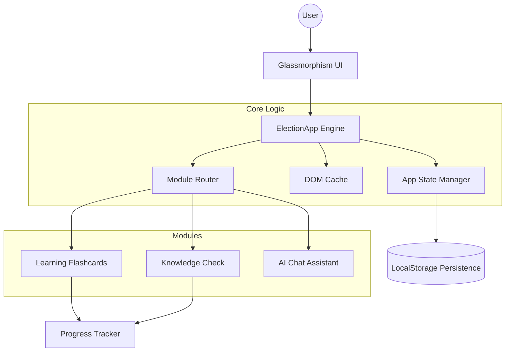
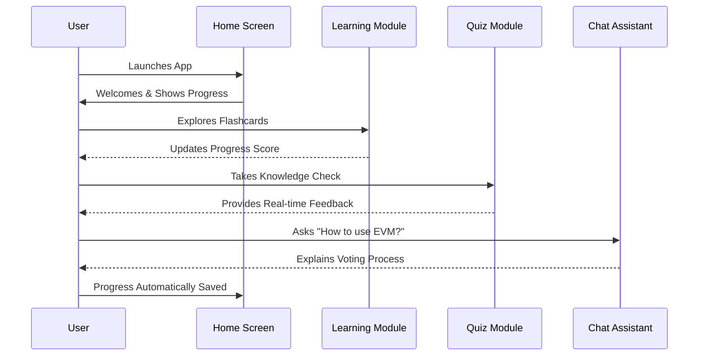

#  Election Guide India 🇮🇳 (v2.0)

An interactive, high-fidelity educational application designed to empower Indian citizens with knowledge about the electoral process, democratic rights, and the voting system. 

Built with a focus on **Security**, **Accessibility**, and **Premium User Experience**.

---

## 📐 Application Architecture

The application follows a modular, state-driven architecture centered around the `ElectionApp` engine.



---

## 🚀 Key Features

- **📚 Interactive Learning**: 3D-flip flashcards to master electoral terminology and roles.
- **📝 Knowledge Check**: Dynamic quiz system with real-time feedback and progress tracking.
- **🤖 AI Chat Assistant**: Keyword-driven assistant providing instant answers about EVMs, NOTA, and the voting process.
- **📊 Progress Persistence**: Automatic saving and loading of your learning journey using encoded `localStorage`.
- **💎 Premium Design**: State-of-the-art Glassmorphism UI with smooth micro-interactions and an Indian-centric palette.

---

## ♿ Accessibility & Standards

Election Guide India is built to be inclusive for everyone:
- **ARIA Compliant**: Full semantic structure with appropriate ARIA roles and live regions.
- **Keyboard Navigation**: Skip-links and robust focus management for non-mouse users.
- **Visual Clarity**: High-contrast typography and focus-visible indicators.
- **Security First**: 100% immune to XSS via secure DOM manipulation (zero `innerHTML` usage).

---

## 🛠️ Technical Stack

- **Structure**: Semantic HTML5
- **Logic**: Vanilla JavaScript (ES6+ Modular Architecture)
- **Styling**: Modern CSS3 (Variables, Mesh Gradients, Glassmorphism)
- **Assets**: Custom AI-generated professional branding
- **Deployment**: Dockerized and ready for Google Cloud Run

---

## 🖥️ Getting Started

1. **Clone the repository**:
   ```bash
   git clone https://github.com/gaurirangbhal77/Election-Guide-India.git
   ```
2. **Open the app**:
   - Simply open `index.html` in any modern web browser.
   - OR use a local server: `python -m http.server 8080`.

---

## 🗺️ User Journey



---

*Developed with ❤️ for the world's largest democracy.*
