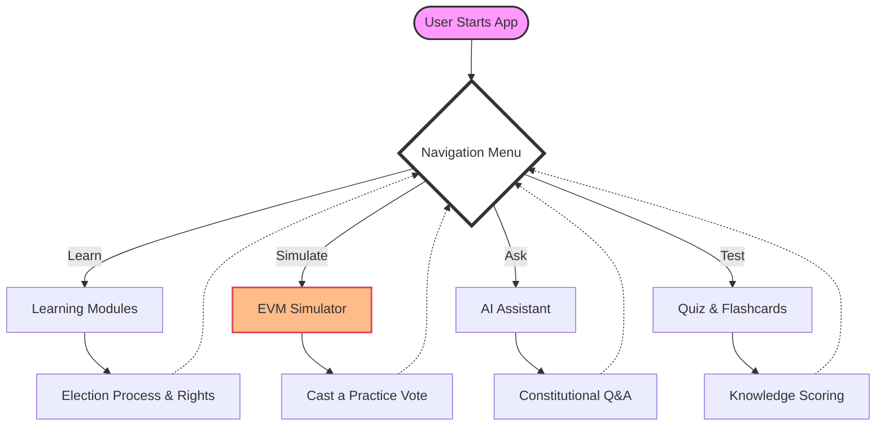

# Election Guide India 🇮🇳

An interactive educational platform designed to empower Indian citizens with knowledge about the electoral process, democratic rights, and the voting system.

## 🚀 Live Demo
[View the Live App](https://prompt-war-5183385783.us-central1.run.app)

---

## 📝 About the Project

**Election Guide India** is a comprehensive educational tool built to bridge the gap between complex electoral procedures and citizen understanding. It provides a "learn-by-doing" experience through interactive simulations and AI-driven assistance.

The project focuses on three core pillars:
1.  **Awareness:** Simplifying the constitutional and procedural aspects of Indian elections.
2.  **Practicality:** Providing a hands-on EVM (Electronic Voting Machine) simulation to familiarize first-time voters with the process.
3.  **Engagement:** Using gamified elements like quizzes and flashcards to make learning about democracy fun and memorable.

---

## 📊 Application Flow Diagram

Below is the high-level user flow of the application, illustrating how users navigate through the various educational modules.



---

## ✨ Features

-   **Interactive Learning Modules:** Explore the history, process, and significance of Indian elections through interactive cards and progress tracking.
-   **Realistic EVM Simulator:** A faithful recreation of an Electronic Voting Machine, including candidate buttons, the "Beep" sound, and the VVPAT-style verification.
-   - **AI-Powered Assistant:** A dedicated AI agent that answers specific questions about Indian politics, the Constitution, and voting eligibility.
-   **Flashcards & Quizzes:** Dynamic knowledge checks that help reinforce key concepts and terminology.

---

## 🏗️ Architecture & Tech Stack

The application is built for performance and scale, using modern web standards and containerization.

-   **Frontend:** Vanilla HTML5, CSS3 with custom design tokens, and Modular JavaScript.
-   **Containerization:** Docker (Alpine Linux base for lightweight images).
-   **Deployment:** Google Cloud Run (Fully managed serverless execution).
-   **CI/CD:** Integrated with GitHub for automated source-to-service deployments.

---

## 🐳 Running Locally with Docker

To run this project on your local machine using Docker:

1.  **Build the image:**
    ```bash
    docker build -t election-guide-india .
    ```

2.  **Run the container:**
    ```bash
    docker run -p 8080:80 election-guide-india
    ```
    The app will be available at `http://localhost:8080`.

---

Developed with ❤️ by [gaurirangbhal77](https://github.com/gaurirangbhal77) 🇮🇳
