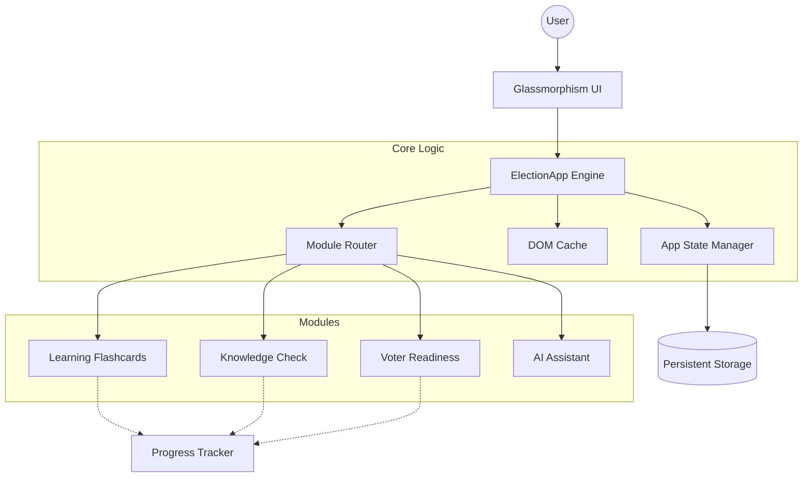

<div align="center">
  
  
  # 🇮🇳 Election Guide India (v2.0)
  
  **Your Personal Interactive Gateway to the World's Largest Democracy**

  [](#)
  [](#)
  [](#)
  [](#)
</div>

---

## ✨ Why Election Guide India?

Voting is not just a right; it's a superpower. But understanding the electoral process can sometimes feel overwhelming. **Election Guide India** transforms learning into an interactive, gamified, and secure experience. 

Whether you're a first-time voter or just brushing up on your democratic knowledge, this app has you covered!

---

## 🚀 Interactive Features

| Feature | Description | Experience It |
| :--- | :--- | :--- |
| 📚 **Smart Flashcards** | 3D-flip cards to master terms like *EVM*, *NOTA*, and *VVPAT*. | Tap or Spacebar to flip! |
| 🎥 **Visual Guides** | Curated YouTube explainers embedded securely within flashcards. | Watch and learn instantly. |
| 📝 **Timed Quizzes** | Test your knowledge with a thrilling **15-second timer** per question. | Can you beat the clock? |
| 📊 **Score Tracking** | Get instant feedback, track your score, and see your final percentage. | Aim for 100%! |
| ✅ **Readiness Checklist** | An interactive checklist to ensure you're fully prepared for Election Day. | Tick off your tasks! |
| 🤖 **AI Chat Assistant** | A keyword-driven bot ready to answer your questions instantly. | Just ask "What is EVM?" |

---

## 🔒 Security & Accessibility First

We believe civic tech should be accessible and safe for everyone:

- 🛡️ **Zero Vulnerabilities**: Enforces a strict Content Security Policy (`style-src 'self'`). Zero inline scripts or styles. No `innerHTML` usage for user inputs.
- ♿ **Fully Accessible**: ARIA-compliant semantic structure, screen-reader friendly live regions, and robust keyboard navigation (skip-links included!).
- 💎 **Glassmorphism UI**: A stunning, modern, custom-built CSS interface that feels premium and responsive on any device.

---

## 📐 Under the Hood (Architecture)



---

## 🖥️ Getting Started in 2 Steps

Want to run it locally? It's incredibly simple:

1. **Clone & Go**:
   ```bash
   git clone https://github.com/gaurirangbhal77/Election-Guide-India.git
   cd Election-Guide-India
   ```
2. **Launch**:
   Just double-click `index.html` in your favorite modern web browser, or serve it locally:
   ```bash
   python -m http.server 3000
   ```
   *Visit `http://localhost:3000` and start learning!*

---

<div align="center">
  <i>Developed with ❤️ for the world's largest democracy.</i>
</div>
